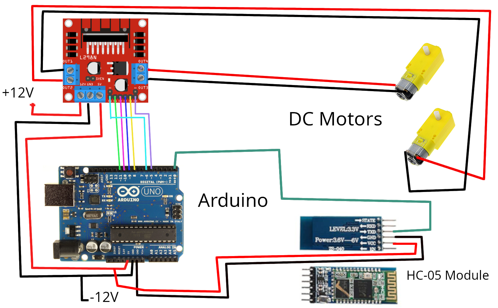

# Bluetooth Controlled car in Arduino.

### *Here is a description for making a bluetooth controlled car.*

#### Upload the "bluetoothCar.ino" code to arduino, gather the parts required, make the connections according to schematic and **take extra 3 hours to make chassis** and there you go, you have a car.

-----
-----

>## Part List
1. Arduino (any version would work).
1. Motor Driver -> l298n H-bridge motor driver.
1. Bluetooth Module -> HC-05 (any serial module would work).
1. DC Motor (2 DC motor (with fornt multi-direction wheel) / 4 Dc motor in parallel connection.)
1. Battery (3 X 18650 in series would do just fine.)
1. "Arduino car" application in android runs quite well for controlling this car !!

-----
-----

>## Schematic

    

### Pin Connection description is also given in the code comments section.
------
-----